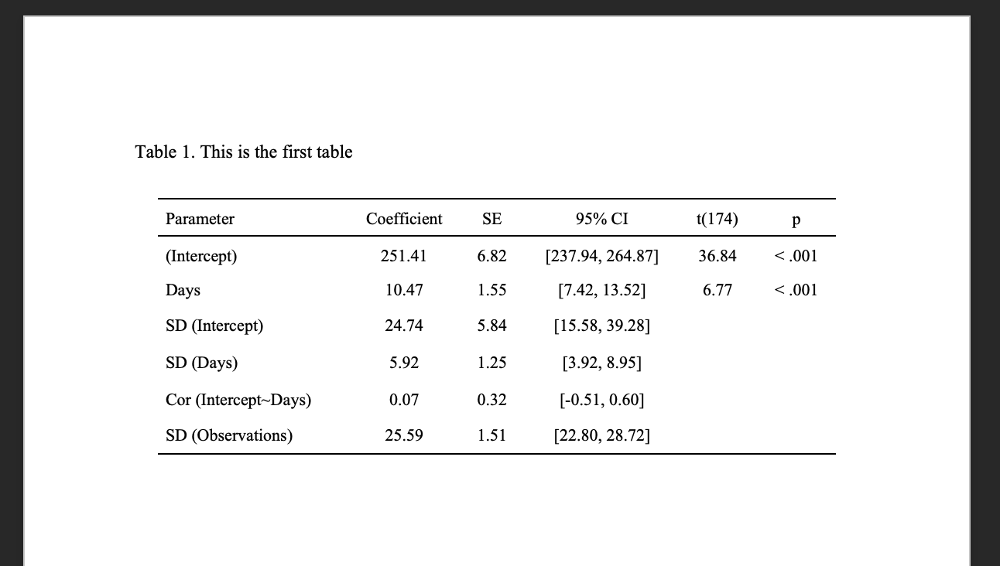

```{css, echo = FALSE}
d-article li p {
    margin-bottom: 0em;
    margin-left: 0;
    padding-left: 0;
}
d-article li {
    margin-bottom: 0em;
    margin-left: 0;
    padding-left: 0;
}
body {
   font-size:14px;
 }
.shaded {
 background-color:lightgrey;
}

```

# Background

Our [research lab](https://lrcl.pitt.edu) at the University of
Pittsburgh has been striving to improve our open science practices over
the last 3-4 years. This has included sharing data and analysis
scripts[^1], using pre-registration prior to analyzing data,[^2] and
generating reproducible figures and results text directly from our
analysis scripts. We're not perfect, and we've made some mistakes
along the way, but we're doing our best.

[^1]: e.g., <https://osf.io/sfutm/> and <https://osf.io/dxvyj/>

[^2]: <https://osf.io/r687h>

In our recent publication entitled *Reproducibility in small-N treatment
research: a tutorial using examples from aphasiology*, we took the [call
for
papers](https://academy.pubs.asha.org/call-for-papers/promoting-reproducibility-for-the-speech-language-and-hearing-sciences/)
a bit too literally and submitted a fully reproducible manuscript. Since we
spent the past 6 months trying to work out how to submit a fully
reproducible manuscript to the ASHA journals (that fit into our typical
writing process), we decided it might be useful if we described a few
methods we landed on (especially for our future selves). Warning: We
use R for everything. But the ideas
could be reasonably implemented using other tools. They're also not
limited to the ASHA journals - and would reasonably generalize to
any journals that require submission in APA formatted Microsoft Word documents.

## Who is this post for?

This post is for you if you:

-   Hand copy results into manuscript (results) text from your
    statistical software

-   Create tables by hand in Microsoft Excel

We also assume that you have some basic familiarity with R and
Rmarkdown. Need a primer? look here: https://psyteachr.github.io/reprores-v2/index.html.

## How do we automate these steps?

Our solution to these less-than-ideal research practices is to generate the 
results section, tables, and figures programmatically in R/Rmarkdown. This can be done piecemeal - where a
script can create each of these separately - the focus of this post.
These steps can also be incorporated into an entire manuscript rendered
in RMarkdown/Quarto, which is [the focus of part 2](linktopart2).

We should also note that there's more than one way to produce
reproducible results text, tables, or figures ready for a manuscript
written in Microsoft Word, and we're just going to cover the ones we've
found the most straightforward, and point the reader to other options we
haven't tried (or didn't like as much).

## Setup

To follow along with this guide, you'll want to have [R and Rstudio
installed](https://psyteachr.github.io/reprores-v2/installingr.html).
You'll also want to install the following packages to play along:

```{r, eval = FALSE}
# Install the following packages if not already installed
install.packages(c("dplyr", "easystats", "lme4", "janitor",
                   "glue", "officer","flextable"))
# Install TJ Mahr's printy package
# install.packages("remotes")
remotes::install_github("tjmahr/printy")
```

## Step 1: Automating your results text

### Option A - Inline reporting using RMarkdown/Quarto

1. Run statistical model
1. Extract results & tidy them up
1. Use inline R reporting to print them in RMarkdown
1. Render Rmarkdown, and copy to manuscript

At this point, rather than re-doing something that is already well
described, we're just going to refer you to TJ Mahr's post on inline
reporting, found here:
<https://www.tjmahr.com/lists-knitr-secret-weapon/>. We've tweaked his
code slightly for our preferences, but the idea is the same. Here's a brief
example. 

```{r}
library(dplyr)
library(lme4)
library(easystats)
library(janitor)
library(printy)

# Fit a model. This is an exmaple model form the lme4 package.
# Then use the tidy() function from the broom.mixed package to extract results
m <- lme4::lmer(Reaction ~ Days + (Days | Subject), sleepstudy)
m_effects <- parameters::model_parameters(m) 

# Use the format_table() function from insight to format results
# We have to do a little extra work to get the df back
# and then clean up the Parameter names for easy access
# Use TJ Mahr's super_split() function to organize the results
m_inline <- m_effects %>%
  insight::format_table(ci_width = NULL) %>%
  janitor::clean_names(replace =setNames("ci", "95% CI")) %>%
  dplyr::mutate(df = m_effects$df_error,
                parameter = janitor::make_clean_names(parameter)) %>%
  printy::super_split(effects, parameter)
```

Use inline R reporting to access the values in the list we created. The following
markdown code:

The effect of period2 was `` `r knitr::inline_expr("m_inline$fixed$days$coefficient")` `` (95% CI:
`` `r knitr::inline_expr("m_inline$fixed$days$ci")` ``, t(`` `r knitr::inline_expr("m_inline$fixed$days$df")` ``) = `` `r knitr::inline_expr("m_inline$fixed$days$t")` ``, p `` `r knitr::inline_expr("m_inline$fixed$days$p")` ``)

turns into: 

The effect of period2 was `r m_inline$fixed$days$coefficient` (95% CI:
`r m_inline$fixed$days$ci`, t(`r m_inline$fixed$days$df`) = `r m_inline$fixed$days$t`, p `r m_inline$fixed$days$p`). 


### Option B: Using {glue} and {officer}

The second option is to combine the ease of using the {glue} package and
the {officer} package to create a word document with our results in it. We
can write the same text and save it as a character object in R. Instead of
placing the values from our model within inline R code, we can place it
inside curly brackets and place it in the glue function. 

```{r}
library(glue)

paragraph1 <- 
  glue::glue(
  'The effect of {m_inline$fixed$days$parameter} was \\
  {m_inline$fixed$days$coefficient} (95% CI: {m_inline$fixed$days$ci}, \\
  t({m_inline$fixed$days$df}) = {m_inline$fixed$days$t}, \\
  p {m_inline$fixed$days$p}).' 
  )
```

```{r}
print(paragraph1)
```

We can then save this text as a paragraph in a blank word document

```{r}
library(officer)
# create a document and add out paragraph
results_doc <- officer::read_docx() %>%
  officer::body_add_par(paragraph1, style = "Normal")
```

And save this as a new word document: 

```{r, eval = FALSE}
print(results_doc, target = "results.docx")
```

### Bonus - even easier reporting

The {easystats} package {report} has a handy function for reporting the results
of statistical models. You can look up the different parts of a model 
(and other things) that can be reported using `?report()`. It might be 
reasonable to render this text in an rmarkdown document or save it to a word
document as above, and modify it as needed in your manuscript.

```{r}
library(report)

print(
  report::report(m)
)
```

## Automate your tables

There are several ways of making APA-style word tables in R. We used the
[flextable package](https://ardata-fr.github.io/flextable-book/) because
it was easiest to generate tables in the format we wanted. There are many other packages (e.g., papaja, gt, apaTables).

```{r}
library(flextable)
# create the flextable theme
# Note, the theme_apa() is modified from 
# https://github.com/davidgohel/flextable/discussions/426
# hopefully flextable will be out with direct support for apa formatting soon!
theme_apa <- function(.data) {
  apa.border <- list("width" = 1, color = "black", style = "solid")
  font(.data, part = "all", fontname = "Times New Roman") %>%
  line_spacing(space = 1, part = "all") %>%
  hline_top(part = "head", border = apa.border) %>%
  hline_bottom(part = "head", border = apa.border) %>%
  hline_top(part = "body", border = apa.border) %>%
  hline_bottom(part = "body", border = apa.border) %>%
  align(align = "center", part = "all", j=-1) %>%
  valign(valign = "center", part = "all") %>%
  colformat_double(digits = 2) %>%
  fix_border_issues()
}
```

```{r, eval = FALSE}
# create a flextable object
# starting with our effects from above, formatting it with
# format_table(), select the columns we need,
# convert it to a flex table, add a caption,
# autofit will determine the width, then add out theme.
t1 <- 
  m_effects %>%
  insight::format_table(ci_width = NULL) %>%
  dplyr::select(Parameter:p) %>%
  flextable::flextable() %>%
  flextable::set_caption("Table 1. This is the first table") %>%
  flextable::autofit() %>%
  theme_apa()

# To save it as a word document, we can start 
# read in a blank template with the times new roman
# as the font
doc <- officer::read_docx("template.docx")
# add the table to the document
doc <- officer::body_add_flextable(doc, value = t1)
# filename within the path we want
print(doc, target = "table1.docx")
```

The saved word document looks like this: 

```{r, echo = FALSE, out.width="50%"}

```

## Summary

This post went over some methods to improve the reproducibility of your
manuscripts in R. These steps don't get you to a fully reproducible document
(there's still some necessary copy-paste), but its a drastic improvement
over any manual copying. In part 2, we review options to produce a fully
reproducible manuscript in Rmarkdown/Quarto. However, for most people, we suspect this option is a great place to start improving reproducibility. It doesn't require you to write or render your entire manuscript in a separate
software, and you can continue to share your documents with collaborators
in ways that you already are. 
