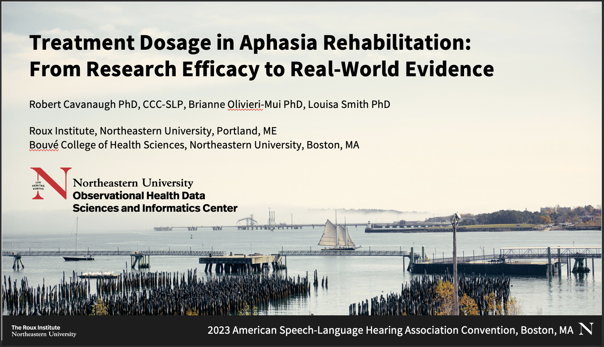

```{r setup, include=FALSE}
knitr::opts_chunk$set(echo = FALSE)
```

#### Treatment Dosage in Aphasia Rehabilitation: From Research Efficacy to Real-World Evidence 

<!-- centered image of preview.png with a link to asha-2023.pdf with 80% width-->
<a href="asha-2023.pdf"></a>

***2023 American Speech-Language Hearing Association Convention, Boston, MA***
