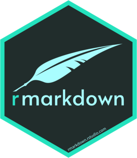

 
```{r, include=FALSE, results='asis'}
library(metathis)

meta() %>%
  meta_social(
    title = "Rob Cavanaugh Personal Website",
    description = "Rob Cavanaugh's research portfolio",
    url = "https://robcavanaugh.me/",
    image = "images/olympus.jpg",
    image_alt = "Mount Olympus, WA",
    og_type = "website",
    og_author = "Rob Cavanaugh",
    twitter_card_type = "summary",
    twitter_creator = "@littlejohnsband"
  )

```

## About

I'm a third-year Ph.D. Candidate in the Department of Communication Sciences and Disorders at the University of Pittsburgh. I'm also a clinical speech-language pathologist. My research aims to improve everyday communication and quality of life outcomes for people with aphasia and related neurogenic communication disorders. Specifically, I'm focused on identifying and resolving implementation gaps in aphasia rehabilitation, improving patient access to evidence-based care, and enhancing treatment specification and effectiveness. I'm also interested in statistics and data science, programming (R + python + js), data visualization, and science communication. 

Outside of my day job, you can find me with my wife, Amanda - somewhere outdoors, typically in a national park, and ideally on top of a mountain.

<div style = "box-sizing: border-box;
    min-height: 100%;
    padding: 0 0 50px;
    position: relative;">
    
<center style = "bottom: 0;
    height: 50px;
    left: 0;
    position: absolute;
    width: 100%;">
    
<hr>

<p style="padding-bottom:10px;"><em style="font-size:.75rem;">Built with:</em>
<a href="https://www.tidyverse.org/" target="_blank">
  
</a>
<a href="https://rmarkdown.rstudio.com/" target="_blank">
  
</a>
<a href="https://rstudio.github.io/distill/" target="_blank">
  
</a>
<a href="https://github.com/rstudio/pagedown" target="_blank">
  
</a>
<a href="http://nickstrayer.me/datadrivencv/" target="_blank">
  
</a>
<a href="https://pkg.garrickadenbuie.com/metathis/" target="_blank">
  
</a>
<br>
<em style="font-size:.5em">
Last updated on `r Sys.Date()`
</em>
</p>


</center>

</div>