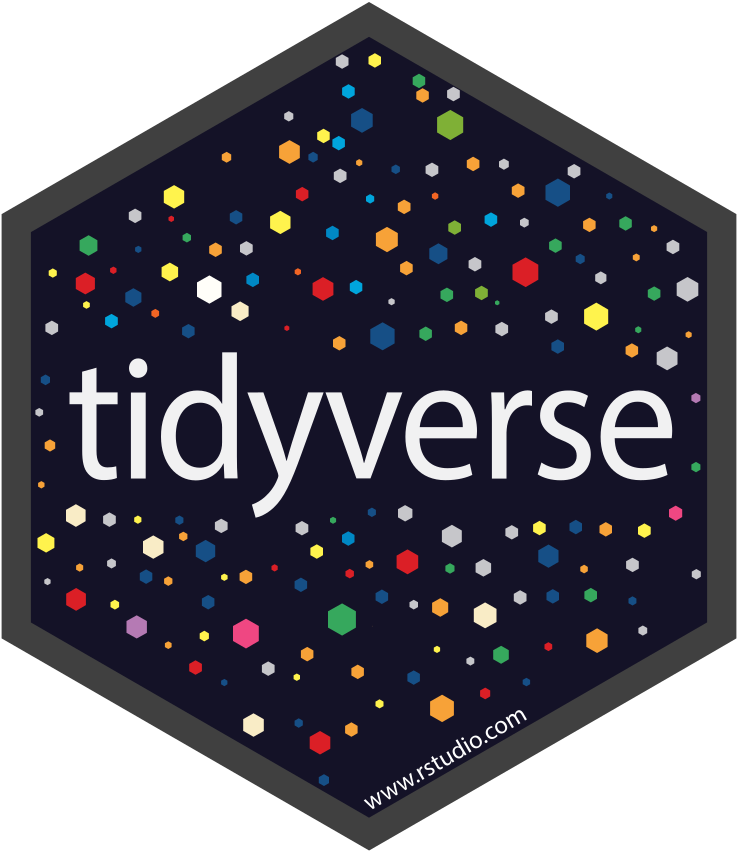

 
```{r, include=FALSE, results='asis'}
library(metathis)

meta() %>%
  meta_social(
    title = "Rob Cavanaugh Personal Website",
    description = "Rob Cavanaugh's research portfolio",
    url = "https://robcavanaugh.me/",
    image = "images/olympus.jpg",
    image_alt = "Mount Olympus, WA",
    og_type = "website",
    og_author = "Rob Cavanaugh",
    twitter_card_type = "summary",
    twitter_creator = "@littlejohnsband"
  )

```

I'm a research data analyst at the ***Observational Health Data Sciences and Informatics Center*** (OHDSI) at Northeastern University's Roux Institute in Portland, ME. I work with Dr. Brianne Olivieri-Mui and Dr. Louisa Smith at the intersection of health services research, epidemiology, and data science, primarily using insurance claims and electronic health record data within the OMOP Common Data Model (CDM) to examine disparities in health care outcomes. I also develop open-source software in R and training materials for students who are looking to conduct research using OHDSI's OMOP CDM. 

I'm a clinical speech-language pathologist by training with expertise in stroke and traumatic brain injury rehabilitation. My recently completed doctoral research focused on improving the effectiveness of aphasia rehabilitation services from complementary perspectives: (1) specifying the active ingredients of aphasia treatments, (2) evaluating patterns of treatment-related change in discourse-level communication, and (3) examining the current state of clinical speech-language services for individuals with post-stroke aphasia. My long term goals are to integrate my clinical background, translational research training, and growing expertise in health services research and data science to conduct and collaborate on high impact research that improves real-world clinical practice in neurorehabilitation. 

Outside of my day job, you can find me and my wife Amanda exploring the outdoors with our two dogs, Murphy and Willa.


<!-- <div style = "box-sizing: border-box; -->
<!--     min-height: 10%; -->
<!--     padding: 0 0 50px; -->
<!--     position: relative;"> -->

<!-- <center style = "bottom: 0; -->
<!--     height: 50px; -->
<!--     left: 0; -->
<!--     position: absolute; -->
<!--     width: 100%;"> -->

<!-- <hr> -->

<!-- <p style="padding-bottom:10px;"><em style="font-size:.75rem;">Built with:</em> -->
<!-- <a href="https://www.tidyverse.org/" target="_blank"> -->
<!--    -->
<!-- </a> -->
<!-- <a href="https://rmarkdown.rstudio.com/" target="_blank"> -->
<!--    -->
<!-- </a> -->
<!-- <a href="https://rstudio.github.io/distill/" target="_blank"> -->
<!--    -->
<!-- </a> -->
<!-- <a href="https://github.com/rstudio/pagedown" target="_blank"> -->
<!--    -->
<!-- </a> -->
<!-- <a href="http://nickstrayer.me/datadrivencv/" target="_blank"> -->
<!--    -->
<!-- </a> -->
<!-- <a href="https://pkg.garrickadenbuie.com/metathis/" target="_blank"> -->
<!--    -->
<!-- </a> -->
<!-- <br> -->
<!-- <em style="font-size:.5em"> -->
<!-- Last updated on `r Sys.Date()` -->
<!-- </em> -->
<!-- </p> -->


<!-- </center> -->

<!-- </div> -->


<!-- body { -->
<!--         background-color: #FFFFFF; -->
<!--       } -->

<!--       .rounded { -->
<!--         border-radius:50%!important; -->
<!--       } -->


