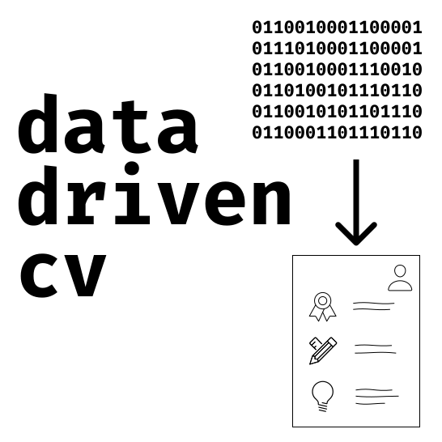

 
```{r, include=FALSE, results='asis'}
library(metathis)

meta() %>%
  meta_social(
    title = "Rob Cavanaugh Personal Website",
    description = "Rob Cavanaugh's research portfolio",
    url = "https://robcavanaugh.me/",
    image = "images/olympus.jpg",
    image_alt = "Mount Olympus, WA",
    og_type = "website",
    og_author = "Rob Cavanaugh",
    twitter_card_type = "summary",
    twitter_creator = "@littlejohnsband"
  )

```

```{css, echo = FALSE}
button {
        background-color: #ffffff!important;
      }
      
body {
        background-color: #ffffff!important;
      }
```
<br>

I'm a Ph.D. Candidate in Communication Sciences and Disorders at the [University of Pittsburgh](https://www.lrcl.pitt.edu/) and clinical speech-language pathologist. My research currently focuses on identifying and honing the active ingredients in treatments for post-stroke aphasia and related disorders. I'm especially keen on understanding the ingredients that facilitate generalization to outcomes prioritized by people with aphasia (e.g., connected speech). Improving our understanding of the active ingredients can inform treatment theory and improve treatment effectiveness. When implemented via technology (e.g., apps) treatments, more potent interventions can provide individuals with aphasia access to greater treatment intensity while high value face-to-face clinical time can be dedicated to counseling, goal setting, and life participation. 

Ultimately, my hope is that this work will promote speech-language pathologists ability to integrate treatments that address language difficulties, communication skills, life participation and well being, even with [today's clinical practice constraints](https://podcasts.apple.com/ph/podcast/episode-77-voltage-drop-and-aphasia-treatment/id1166457367?i=1000539987679). To achieve these goals, my [research](https://robcavanaugh.com/research.html) leverages quantitative methods such as multilevel modeling, Bayesian statistics, and natural language processing tools.  I've developed advanced skills in statistical programming (R, python), including using packages like R {shiny} for [science communication](https://robcavanaugh.app/shiny/effect-sizes/) or [making research products available to clinicans](https://aphasia-apps.shinyapps.io/PNT-CAT/) ([more tools listed here](https://robcavanaugh.com/shiny)). I'm passionate about increasing open science practices in aphasia research and identifying small tech-focused projects with a potential for large impact, such as [aphasiaresearch.org](https://aphasiaresearch.org), which helps aims to help people with aphasia find aphasia research studies.

Outside of my day job, you can find me with my wife, Amanda - somewhere outdoors, typically in a national park, and ideally on top of a mountain.

<div style = "box-sizing: border-box;
    min-height: 10%;
    padding: 0 0 50px;
    position: relative;">
    
<center style = "bottom: 0;
    height: 50px;
    left: 0;
    position: absolute;
    width: 100%;">
    
<hr>

<p style="padding-bottom:10px;"><em style="font-size:.75rem;">Built with:</em>
<a href="https://www.tidyverse.org/" target="_blank">
  
</a>
<a href="https://rmarkdown.rstudio.com/" target="_blank">
  
</a>
<a href="https://rstudio.github.io/distill/" target="_blank">
  
</a>
<a href="https://github.com/rstudio/pagedown" target="_blank">
  
</a>
<a href="http://nickstrayer.me/datadrivencv/" target="_blank">
  
</a>
<a href="https://pkg.garrickadenbuie.com/metathis/" target="_blank">
  
</a>
<br>
<em style="font-size:.5em">
Last updated on `r Sys.Date()`
</em>
</p>


</center>

</div>


<!-- body { -->
<!--         background-color: #FFFFFF; -->
<!--       } -->

<!--       .rounded { -->
<!--         border-radius:50%!important; -->
<!--       } -->


