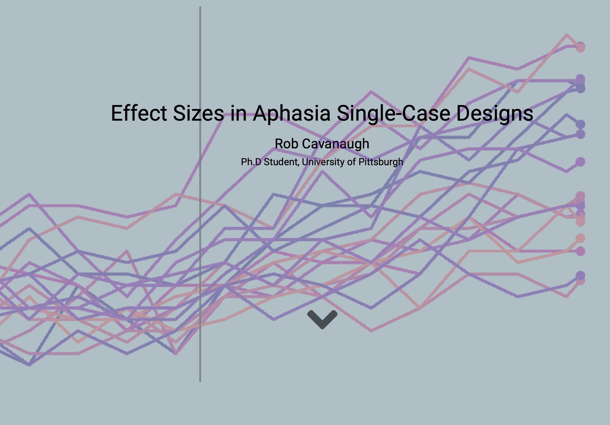
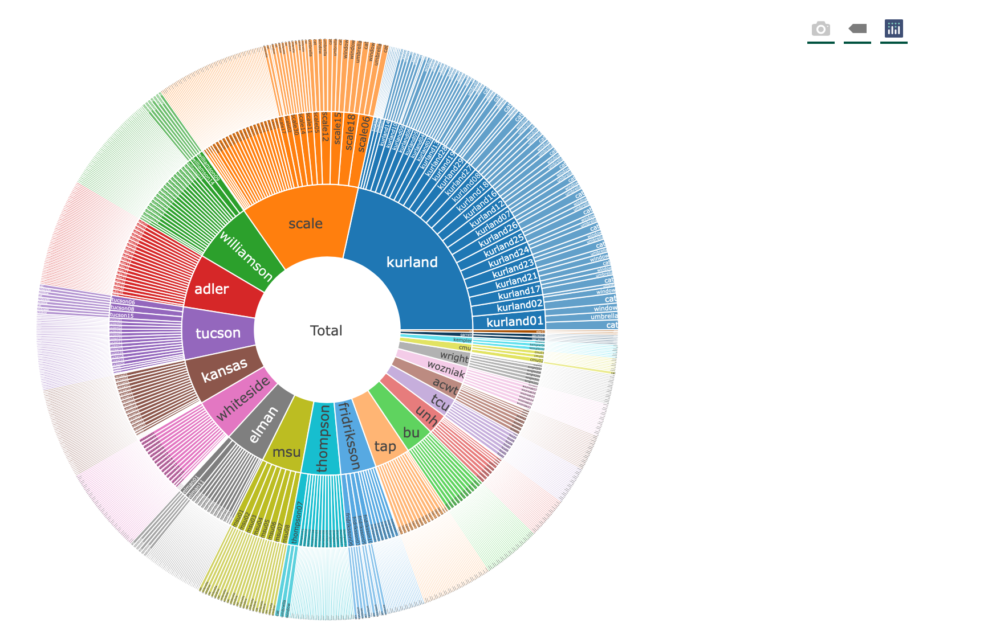
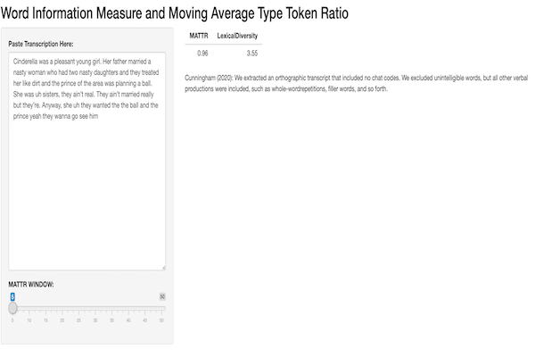

```{css, echo=FALSE}

body {
  padding: 50px 50px;
  background-color: white;
}

.chart-wrapper {
  background: transparent;
  border: 2px;
  padding: 20px;
}

.navbar{
  visibility: hidden
}

```

```{r setup, include=FALSE}
knitr::opts_chunk$set(echo = FALSE)
library(flexdashboard)
library(bslib)
```

## Column

### [Aphasia Effect Size Primer](https://rb-cavanaugh.shinyapps.io/aphasia-effect-sizes/){target="_blank" style="color: #005D8F; text-decoration: none;"} {data-height="250"}

```{r echo=FALSE}

```

### [Correct Information Unit Web-app](https://rb-cavanaugh.shinyapps.io/aphasia-ciu/){target="_blank" style="color: #005D8F; text-decoration: none;"} {data-height="250"}

```{r echo=FALSE}
knitr::include_graphics("images/cius.png")
```

## Column {data-padding = 20}

### [TBDBr R Package](https://talkbank.github.io/TBDBr/){target="_blank" style="color: #005D8F; text-decoration: none;"} {data-height="250"}

```{r echo=FALSE}

```

### [Gantts for Grants](https://github.com/rbcavanaugh/gantt){target="_blank" style="color: #005D8F; text-decoration: none;"} {data-height="250"}

```{r echo=FALSE}
knitr::include_graphics("images/gantt.png")
```

## Column {data-padding = 20}

### [Lexical Diversity Web-app](https://rb-cavanaugh.shinyapps.io/WIM_MATTR/){target="_blank" style="color: #005D8F; text-decoration: none;"} {data-height="250"}

```{r echo=FALSE}

```

### Core Lexicon & Main Concepts Web-app (soon!) {data-height="250"}

```{r echo=FALSE}
knitr::include_graphics("images/core.png")
```
